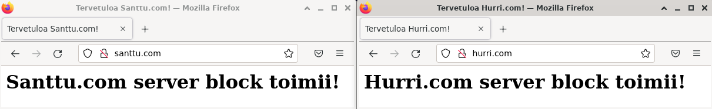

# easylemp - THIS PROJECT WONT BE UPDATED AND HAS BEEN MOVED TO: https://github.com/santtuhurri/lemphelper
[Palvelinten hallinta](https://terokarvinen.com/2021/configuration-management-systems-2022-spring/) -kurssin viimeinen projekti.

- Tekijä: Santtu Hurri
- Käyttöjärjestelmä: Debian 11 "bullseye"  
- Versio: alpha
- Lisenssi: GNU General Public License v2.0

Tässä projektissa on tarkoitus rakentaa oma moduli, joka asentaa Linux-koneelle LEMP-stackin 'Linux(L - käyttöjärjestelmä), Nginx(E - webpalvelin), MariaDB(M - tietokanta) & PHP(P - ohjelmointikieli)', tekee asennettuihin ohjelmiin tarvittavat konfiguroinnit sekä ottaa käyttöön kaksi Nginx server blockia (mahdollistaa usean sivuston samalla IP-osoitteella) eli virtual hostia. Pyrin myös siihen, että moduli asentaisi ainakin toiselle server blockille  käyttöön jonkun palvelun. Tarkoitus on, että käyttäjä saisi pienillä muutoksilla käyttöönsä valmiin paketin web-palvelimella työskentelyä varten.



Alustava init.sls tiedosto Nginxia varten:

```
nginx:
  pkg.installed

/var/www/html/index.html:
  file.managed:
    - source: salt://nginx-moduli/index.html

/var/www/santtu.com/html/index.html:
  file.managed:
    - source: salt://nginx-moduli/santtu.com/html/index.html
    - makedirs: True

/etc/nginx/sites-available/santtu.com.conf:
  file.managed:
    - source: salt://nginx-moduli/santtu.com.conf

/etc/nginx/sites-enabled/santtu.com.conf:
  file.symlink:
    - target: /etc/nginx/sites-available/santtu.com.conf

/var/www/hurri.com/html/index.html:
  file.managed:
    - source: salt://nginx-moduli/hurri.com/html/index.html
    - makedirs: True

/etc/nginx/sites-available/hurri.com.conf:
  file.managed:
    - source: salt://nginx-moduli/hurri.com.conf

/etc/nginx/sites-enabled/hurri.com.conf:
  file.symlink:
    - target: /etc/nginx/sites-available/hurri.com.conf

/etc/hosts:
  file.managed:
    - source: salt://nginx-moduli/hosts

nginx.service:
  service.running:
    - watch:
      - file: /etc/nginx/sites-available/santtu.com.conf
      - file: /etc/nginx/sites-available/hurri.com.conf
```
